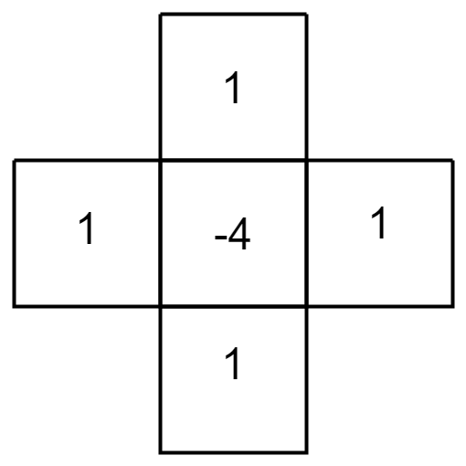

# 2D Wave Simulation

## The Wave Equation

This is the two-dimensional wave equation which describes wave propagation.
$$
\frac{\part^2 u}{\part t^2} = c^2 
	\left( \frac{\part^2 u}{\part x^2}
    	 + \frac{\part^2 u}{\part y^2} \right)
$$

* $u$ represents the wave function $u(x, y, t)$. It can represent various quantities, such as pressure in a sound wave or the height of water waves, given a particular position and time.

* $t$ is time.
* $x$ and $y$ are the spatial coordinates.

* $c$ is the speed of wave propagation.

Starting on the left $\frac{\part^2 u}{\part t^2}$, this is the second time derivative of the wave function which represents the acceleration of the wave in time. The right side of the equation $\frac{\part^2 u}{\part x^2} + \frac{\part^2 u}{\part y^2}$ is the second spatial derivative of the wave function for each dimension. This would represent the "curvature" of the wave in space. This whole equation thus shows that the acceleration of the wave in time is governed by the curvature of the wave in space multiplied by some constant wave speed $c$​.

## Time Derivative

Since we are dealing with discrete values for both space (a grid) and time (individual frames/timesteps), we need a way to approximate these second derivatives. Essentially, given a current grid state and previous states, we want to determine what the next state/frame should be in time. For this, we will use the finite difference method which allows us to approximate derivatives given a certain number of states in either time or space.

The second-order finite difference formula for one dimension is
$$
f''(x) \approx \frac{f(x+h)-2f(x)+f(x-h)}{h^2}
$$

* $x$ is the position in space
* $h$ is the distance between discrete points in space

Since we want to find the derivative of time and not space we can adjust this formula. Instead of looking at discrete distances left and right of a position, we can look forward and backward in time. Now $h$ represents the delta timestep between states rather than between spatial grid points. To represent this better, we can say $f(x+h)$ is the state in the future $f_\text{future}(x)$, $f(x)$ is the current state $f_\text{present}(x)$, and $f(x-h)$ is the state in the past $f_\text{past}(x)$. We can also say $h$ is the delta time between states or $\Delta t$.

Now we get
$$
f''(x) \approx \frac{f_\text{future}(x) - 2f_\text{present}(x) + f_\text{past}(x)}{\Delta t^2}
$$
However, this assumes we have one spatial dimension $x$, so we can substitute $x$ in the functions for $(x, y)$​.
$$
f''(x,y) \approx \frac{f_\text{future}(x,y) - 2f_\text{present}(x,y) + f_\text{past}(x,y)}{\Delta t^2}
$$
Our goal is to determine the state of the function in the future at a specific $(x,y)$ coordinate. This means we need to solve for $f_\text{future}(x,y)$
$$
f_\text{future}(x,y) = f''(x,y)\Delta t^2 - f_\text{past}(x,y) + 2f_\text{present}(x,y)
$$
Going back to our original wave propagation equation, $\frac{\part^2 u}{\part t^2}$ is represented as $f''(x,y)$​ in our equation. They are the same, just different notation and also a partial derivative because the wave function $u(x, y, t)$ is a function of both space and time and thus just taking the derivative of time makes it a partial derivative instead of a complete derivative.
$$
f_\text{future}(x,y) = \frac{\part^2 u}{\part t^2}\Delta t^2 - f_\text{past}(x,y) + 2f_\text{present}(x,y)
$$
In our simulation, we can store the present $f_\text{present}(x,y)$ and past $f_\text{past}(x,y)$ states of our simulation in separate buffers and also keep track of the timestep $\Delta t$, however, in order to fully calculate the future state, we need the second partial derivative of the wave function with respect to time $\frac{\part^2 u}{\part t^2}$. Using the original wave propagation function, we can substitute the right side of the equation in.
$$
f_\text{future}(x,y) = c^2 
	\left( \frac{\part^2 u}{\part x^2}
    	 + \frac{\part^2 u}{\part y^2} \right)
   	\Delta t^2 
	- f_\text{past}(x,y) + 2f_\text{present}(x,y)
$$

## Spatial Derivative

We now need to approximate the second spatial derivative of the wave function $\frac{\part^2 u}{\part x^2}+\frac{\part^2 u}{\part y^2}$. We can use the same method we used for time; the finite difference method. However, unlike time where there is a single dimension, we have two spatial dimensions thus requiring us to use the two-dimensional second-order finite difference formula.
$$
f''(x,y) \approx \frac{f(x-h,y)+f(x+h,y)-4f(x,y)+f(x,y-h)+f(x,y+h)}{\Delta g^2}
$$

* $x$ and $y$ are coordinates in space
* $\Delta g$ is the distance between grid points.

Even though this equation looks pretty complicated, it can actually be visualized nicely through a stencil which can be imagined as an overlay applied on top of a grid where the number is a multiplier.



We can substitute this into our equation for predicting the future.
$$
f_\text{future}(x,y) = c^2 f_\text{present}''(x,y) \Delta t^2 
	- f_\text{past}(x,y) + 2f_\text{present}(x,y)
$$
Now we have everything necessary to solve for $f_\text{future}(x,y)$. We simply need to provide neighboring grid cells surrounding $(x,y)$, a past value of $(x,y)$ and some constants such as wave speed $c$, timestep $\Delta t$, and grid spacing $\Delta g$.

## Implementation of Future State

```c++
#pragma once

#include <array>

#include "common.hpp"

class WaveSim {
public:
    WaveSim(
        const int size, const float wave_speed, const float grid_spacing, const float timestep, const float loss = 1.0f)
        : c_size(size)
        , c_wave_speed(wave_speed)
        , c_grid_spacing(grid_spacing)
        , c_timestep(timestep)
        , c_loss(loss)
        , m_buffer_past(c_size * c_size, 0.0f)
        , m_buffer_present(c_size * c_size, 0.0f)
        , m_buffer_future(c_size * c_size, 0.0f)
    {
    }

    void set_at(const Vector2i pos, const float value)
    {
        m_buffer_present[pos_to_idx(pos)] = value;
    }

    [[nodiscard]] float value_at(const Vector2i pos) const
    {
        return m_buffer_present[pos_to_idx(pos)];
    }
    void update()
    {
        for (int i = 0; i < c_size * c_size; ++i) {
            m_buffer_future[i] = future_at(idx_to_pos(i));
            m_buffer_future[i] *= c_loss;
        }
        std::swap(m_buffer_past, m_buffer_present);
        std::swap(m_buffer_present, m_buffer_future);
    }

    [[nodiscard]] size_t pos_to_idx(const Vector2i pos) const
    {
        return pos.y * c_size + pos.x;
    }

    [[nodiscard]] Vector2i idx_to_pos(const size_t idx) const
    {
        const int y = static_cast<int>(idx / c_size);
        const int x = static_cast<int>(idx % c_size);
        return { x, y };
    }

private:
    [[nodiscard]] bool in_bounds(const Vector2i pos) const
    {
        return pos.x >= 0 && pos.x < c_size && pos.y >= 0 && pos.y < c_size;
    }

    [[nodiscard]] float spatial_derivative_at(const Vector2i pos) const
    {
        constexpr std::array<Vector2i, 4> neighbors { { { -1, 0 }, { 1, 0 }, { 0, -1 }, { 0, 1 } } };
        float neighbor_sum = 0.0f;
        for (const auto& [x, y] : neighbors) {
            if (const Vector2i neighbor { pos.x + x, pos.y + y }; in_bounds(neighbor)) {
                neighbor_sum += m_buffer_present[pos_to_idx(neighbor)];
            }
        }
        const float numerator = neighbor_sum - 4.0f * m_buffer_present[pos_to_idx(pos)];
        const float denominator = c_grid_spacing * c_grid_spacing;
        return numerator / denominator;
    }

    [[nodiscard]] float future_at(const Vector2i pos) const
    {
        return c_wave_speed * c_wave_speed * spatial_derivative_at(pos) * c_timestep * c_timestep
            - m_buffer_past[pos_to_idx(pos)] + 2.0f * m_buffer_present[pos_to_idx(pos)];
    }

    const int c_size;
    const float c_wave_speed;
    const float c_grid_spacing;
    const float c_timestep;
    const float c_loss;
    std::vector<float> m_buffer_past;
    std::vector<float> m_buffer_present;
    std::vector<float> m_buffer_future;
};
```


