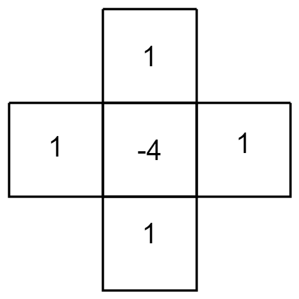

# Schrodinger Wave Simulation

## The Schrodinger Equation

Time dependent Schrodinger equation in one dimension
$$
i\hbar\frac{\part\Psi}{\part t} = -\frac{\hbar^2}{2m}\frac{\part^2\Psi}{\part x^2}+V\Psi
$$
where

* $i$ is the imaginary number $\sqrt{-1}$
* $\hbar$ is the reduced Planck constant $\frac{h}{2\pi} = 1.055\times10^{-34} \text{ J}\cdot\text{s}$
* $\Psi$ is the wave function dependent both on space and time $\Psi(x,t)$
* $m$ is the mass of the particle
* $V$ is the potential function which is dependent on space $V(x)$

Since we are dealing with two dimensions, we will add a $y$ dependence on the equation
$$
i\hbar\frac{\part\Psi}{\part t} = -\frac{\hbar^2}{2m}
	\left( \frac{\part^2\Psi}{\part x^2} + \frac{\part^2\Psi}{\part y^2} \right) + V\Psi
$$

## Time Derivative

To approximate the first order partial derivative for time, we will use the forward finite difference method formula
$$
f'(x) \approx \frac{f(x+h)-f(x)}{h}
$$
where $h$ represents a discrete step which in this case is our timestep since we are taking the derivative with respect to time which we will rewrite as $\Delta t$. This means $f(x+h)$ can be represented as the value of the function at the next future timestep so we will rewrite it as $f_\text{future}(x)$.
$$
f'(x) \approx \frac{f_\text{future}(x)-f(x)}{\Delta t}
$$

## Spatial Derivative

We will use the two dimensional central second order finite difference method to approximate the second order spatial derivatives $\frac{\part^2\Psi}{\part x^2}$ and $\frac{\part^2\Psi}{\part y^2}$.
$$
f''(x,y) \approx \frac{f(x-g,y)+f(x+g,y)-4f(x,y)+f(x,y-g)+f(x,y+g)}{g^2}
$$
where $g$​ is the grid spacing. This can also be visualized with a stencil where each number is a multiplier.

## Putting It All Together

We will start with the Schrodinger equation
$$
i\hbar\frac{\part\Psi}{\part t} = -\frac{\hbar^2}{2m}
	\left( \frac{\part^2\Psi}{\part x^2} + \frac{\part^2\Psi}{\part y^2} \right) + V\Psi
$$
and then substitute in our approximations for the derivatives
$$
\begin{align}
	&i\hbar\frac{\Psi(x, y, t + \Delta t)-\Psi(x, y, t)}{\Delta t} = \\
	&-\frac{\hbar^2}{2m}
	\frac{\Psi(x-g,y,t)+\Psi(x+g,y,t)-4\Psi(x,y,t)+\Psi(x,y-g,t)+\Psi(x,y+g,t)}{g^2} + 
	V(x,y)\Psi(x,y,t)
\end{align}
$$
What we really want is the future value of the wave function in time which is what $\Psi(x,y,t+\Delta t)$ represents so we will solve for that.
$$
\begin{align}
	&\Psi(x, y, t + \Delta t) = \\
	&i\Delta t\frac{\hbar}{2m}
	\frac{\Psi(x-g,y,t)+\Psi(x+g,y,t)-4\Psi(x,y,t)+\Psi(x,y-g,t)+\Psi(x,y+g,t)}{g^2} \\
	&- \frac{i}{\hbar}\Delta tV(x,y)\Psi(x,y,t) + \Psi(x, y, t)
\end{align}
$$

---

$$
\Psi(x,y,t) = Ae^{-\frac{(x-x_0)^2}{2\sigma_x^2}-\frac{(y-y_0)^2}{2\sigma_y^2}}e^{-\frac{(p_xx+p_yy)}{\hbar}} 
$$

